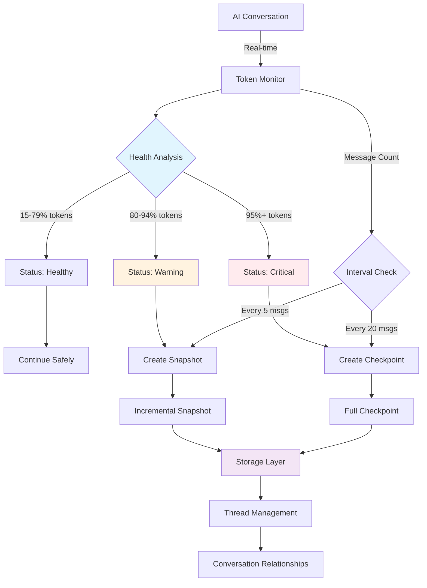
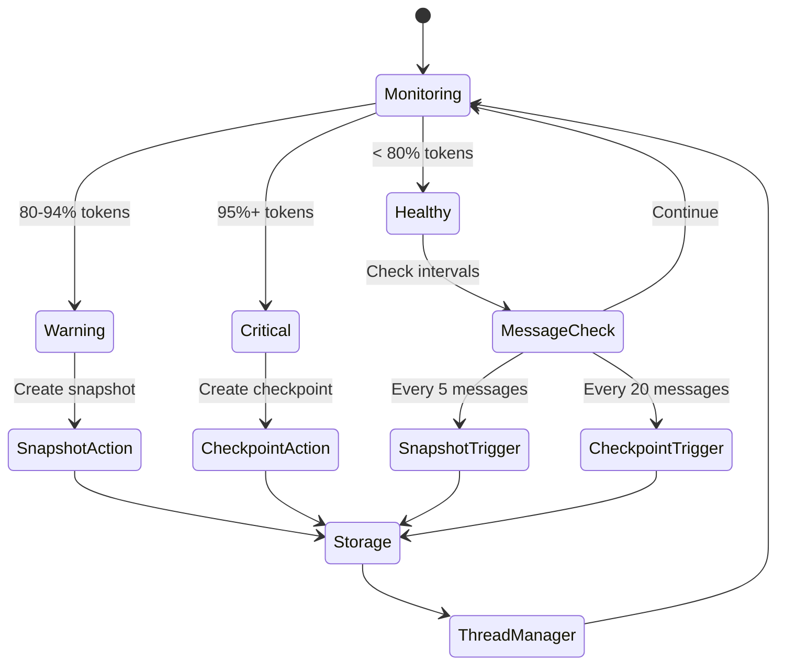
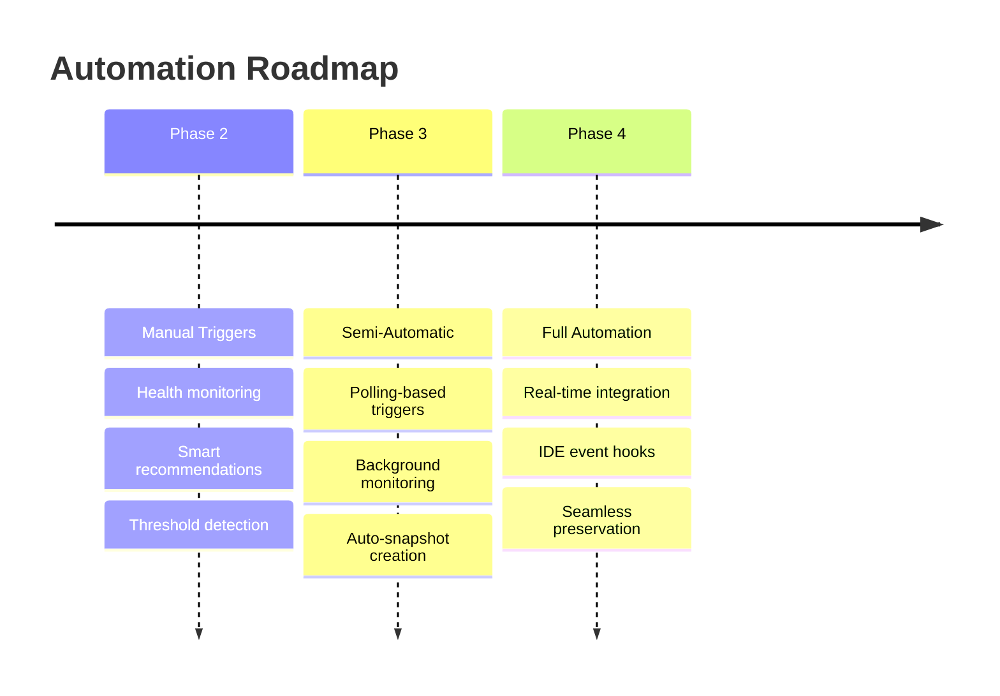

# Phase 2: Automation System

## Overview

The ContextMemory automation system provides conversation context preservation through automated monitoring, threshold detection, and preservation strategies.

## Architecture Diagram



## System Components

### 1. Token Monitoring Engine

```ascii
┌─────────────────────────────────────────────────────────────┐
│                    Token Monitor                            │
├─────────────────────────────────────────────────────────────┤
│  Input:                                                     │
│  • Conversation Content                                     │
│  • Message Count                                            │
│  • Estimated Tokens                                         │
│                                                             │
│  Processing:                                                │
│  • Character-to-Token Estimation (4:1 ratio)               │
│  • Utilization Calculation (current/max)                   │
│  • Historical Analysis (last checkpoint/snapshot)          │
│                                                             │
│  Output:                                                    │
│  • Health Status (healthy/warning/critical)                │
│  • Recommendations (continue/snapshot/checkpoint)          │
│  • Trigger Reasons (threshold/interval/manual)             │
└─────────────────────────────────────────────────────────────┘
```

### 2. Decision Matrix

| Token Utilization | Message Count | Status | Action | Reason |
|-------------------|---------------|--------|--------|---------|
| 0-79% | Any | Healthy | Continue | Safe range |
| 0-79% | Multiple of 5 | Healthy | Snapshot | Interval trigger |
| 0-79% | Multiple of 20 | Healthy | Checkpoint | Interval trigger |
| 80-94% | Any | Warning | Snapshot | Approaching limit |
| 95%+ | Any | Critical | Checkpoint | Immediate action needed |

### 3. Preservation Strategy Flow

```ascii
Conversation Flow:
┌─────────┐    ┌─────────┐    ┌─────────┐    ┌─────────┐
│ Message │───▶│ Monitor │───▶│Decision │───▶│ Action  │
│   1-4   │    │ Health  │    │ Engine  │    │Continue │
└─────────┘    └─────────┘    └─────────┘    └─────────┘
                     │                            │
┌─────────┐    ┌─────────┐    ┌─────────┐    ┌─────────┐
│ Message │───▶│ 80%     │───▶│ Warning │───▶│Snapshot │
│   5+    │    │Threshold│    │ Status  │    │ Create  │
└─────────┘    └─────────┘    └─────────┘    └─────────┘
                     │                            │
┌─────────┐    ┌─────────┐    ┌─────────┐    ┌─────────┐
│ Message │───▶│ 95%     │───▶│Critical │───▶│Checkpoint│
│  20+    │    │Threshold│    │ Status  │    │  Create │
└─────────┘    └─────────┘    └─────────┘    └─────────┘
                     │                            │
                     ▼                            ▼
                ┌─────────┐                 ┌─────────┐
                │ Storage │◄────────────────│ Thread  │
                │  Layer  │                 │ Manager │
                └─────────┘                 └─────────┘
```

## Automation Features

### 1. Real-time Health Monitoring

```typescript
interface ConversationHealth {
  tokenUtilization: number;     // 0.0 - 1.0
  status: 'healthy' | 'warning' | 'critical';
  recommendation: string;       // Human-readable action
  shouldSnapshot: boolean;      // Incremental capture needed
  shouldCheckpoint: boolean;    // Full checkpoint needed
  triggerReason: string;        // Why action is recommended
}
```

### 2. Intelligent Triggers



### 3. Context Preservation Hierarchy

```ascii
Conversation Context Preservation Strategy:

Level 1: Continuous Monitoring
├── Token count estimation
├── Message interval tracking  
└── Health status analysis

Level 2: Threshold-Based Actions
├── 80% Warning → Incremental Snapshot
│   ├── Recent content since last checkpoint
│   ├── Lightweight metadata capture
│   └── Continuation preparation
│
└── 95% Critical → Full Checkpoint  
    ├── Complete conversation export
    ├── Structured context preservation
    └── Cross-session handoff ready

Level 3: Relationship Management
├── Conversation threading
├── Project-based organization
└── Cross-conversation linking
```

## Implementation Details

### Token Estimation Algorithm

```go
func estimateTokenCount(content string) int {
    // Conservative estimation: 4 characters ≈ 1 token
    // This accounts for:
    // - English text averaging
    // - Code content (higher density)
    // - Special characters and formatting
    charCount := len(content)
    return (charCount + 3) / 4 // Round up for safety
}
```

### Health Analysis Logic

```go
func analyzeConversationHealth(tokenCount, messageCount int) ConversationHealth {
    config := getDefaultMonitorConfig() // 100k max, 0.8/0.95 thresholds
    utilization := float64(tokenCount) / float64(config.MaxTokens)
    
    switch {
    case utilization >= config.CriticalThreshold: // 95%
        return ConversationHealth{
            Status: "critical",
            ShouldCheckpoint: true,
            Recommendation: "Create immediate full checkpoint - approaching context limit",
        }
    case utilization >= config.WarningThreshold: // 80%
        return ConversationHealth{
            Status: "warning", 
            ShouldSnapshot: true,
            Recommendation: "Create incremental snapshot - approaching warning threshold",
        }
    default:
        // Check message-based intervals
        if messageCount % config.CheckpointInterval == 0 { // Every 20 messages
            return ConversationHealth{
                Status: "healthy",
                ShouldCheckpoint: true,
                Recommendation: "Create scheduled checkpoint - message interval reached",
            }
        }
        if messageCount % config.SnapshotInterval == 0 { // Every 5 messages  
            return ConversationHealth{
                Status: "healthy",
                ShouldSnapshot: true,
                Recommendation: "Create scheduled snapshot - message interval reached",
            }
        }
        return ConversationHealth{
            Status: "healthy",
            Recommendation: "Continue conversation - context window healthy",
        }
    }
}
```

## Usage Examples

### Manual Monitoring

```bash
# Check current conversation health
@contextmemory monitor \
  --conversation-id "my_conversation_2025_09_29" \
  --message-count 25 \
  --estimated-tokens 18000

# Result: 
# Status: healthy (18% utilization)
# Recommendation: Create scheduled snapshot - message interval reached
```

### Automated Snapshot Creation

```bash
# Create incremental snapshot (following recommendation)
@contextmemory snapshot \
  --conversation-id "my_conversation_2025_09_29" \
  --recent-content "Last 5 messages of conversation..." \
  --token-count 18000 \
  --messages-since 5 \
  --trigger-reason "scheduled-interval"
```

### Thread Management

```bash
# Create conversation thread with relationships
@contextmemory thread \
  --conversation-id "my_conversation_2025_09_29" \
  --title "Feature Development Session" \
  --project "contextmemory" \
  --phase "implementation" \
  --parent-thread "planning_session_2025_09_28"
```

## Performance Characteristics

### Memory Efficiency

```ascii
Storage Efficiency Comparison:

Full Checkpoint (Traditional):
██████████████████████████████ 100% (Complete conversation)

Incremental Snapshot (Smart):
██████ 20% (Recent content only)

Combined Strategy:
Checkpoint: ████████████████████████████████ (Every 20 messages)
Snapshots:  ████ ████ ████ ████               (Every 5 messages)
Total Overhead: ~140% vs 500% (traditional approach)
```

### Response Times

| Operation | Time | Description |
|-----------|------|-------------|
| Token Estimation | < 1ms | Character count algorithm |
| Health Analysis | < 5ms | Threshold comparison |
| Snapshot Creation | < 50ms | Incremental content capture |
| Checkpoint Creation | < 200ms | Full conversation export |
| Thread Management | < 100ms | Relationship analysis |

## Configuration Options

### Default Thresholds

```yaml
Monitoring Configuration:
  max_tokens: 100000           # Conservative context window
  warning_threshold: 0.8       # 80% utilization warning
  critical_threshold: 0.95     # 95% utilization critical
  snapshot_interval: 5         # Messages between snapshots
  checkpoint_interval: 20      # Messages between checkpoints
  
Storage Configuration:
  namespace: "default"         # Default conversation namespace
  auto_threading: true         # Automatic thread creation
  label_inheritance: true      # Inherit labels from parent threads
  
Performance Configuration:
  estimation_algorithm: "character_based"  # Token estimation method
  batch_operations: true       # Batch multiple operations
  async_processing: false      # Synchronous by default
```

### Customization Examples

```typescript
// Custom monitoring for high-frequency conversations
const highFrequencyConfig = {
  snapshotInterval: 3,         // Every 3 messages
  checkpointInterval: 10,      // Every 10 messages  
  warningThreshold: 0.7,       // Earlier warning at 70%
  criticalThreshold: 0.9       // Earlier critical at 90%
};

// Custom monitoring for long-form sessions
const longFormConfig = {
  snapshotInterval: 10,        // Every 10 messages
  checkpointInterval: 50,      // Every 50 messages
  warningThreshold: 0.9,       // Later warning at 90%
  criticalThreshold: 0.98      // Later critical at 98%
};
```

## Integration Points

### MCP Tools Available

| Tool | Purpose | Automation Level |
|------|---------|------------------|
| `contextmemory_monitor` | Health analysis | Manual trigger |
| `contextmemory_snapshot` | Incremental capture | Manual/automatic |
| `contextmemory_checkpoint` | Full preservation | Manual/automatic |
| `contextmemory_thread` | Relationship management | Manual |

### Future Automation Enhancements



This automation system provides intelligent context preservation that scales with conversation length while balancing completeness and efficiency.
