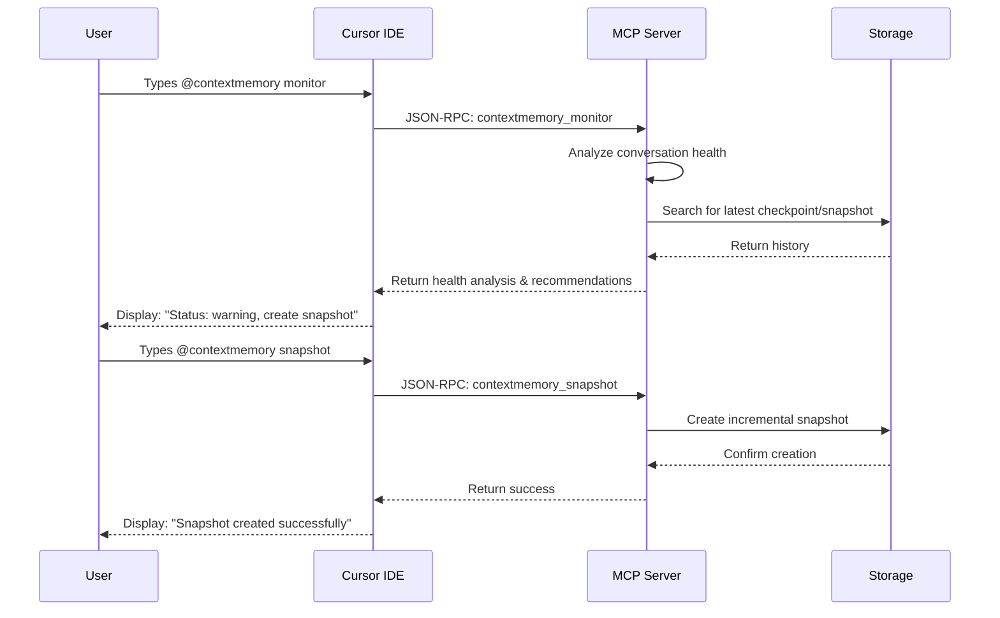
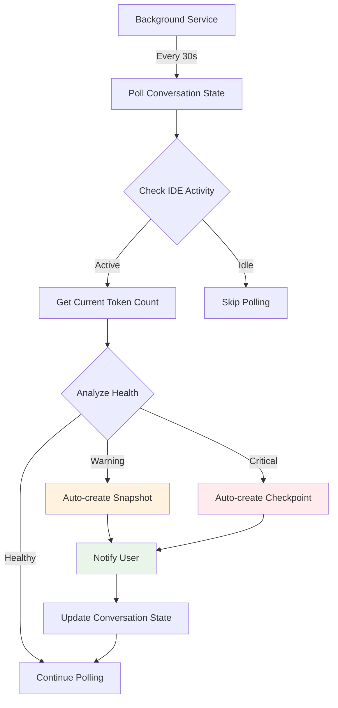
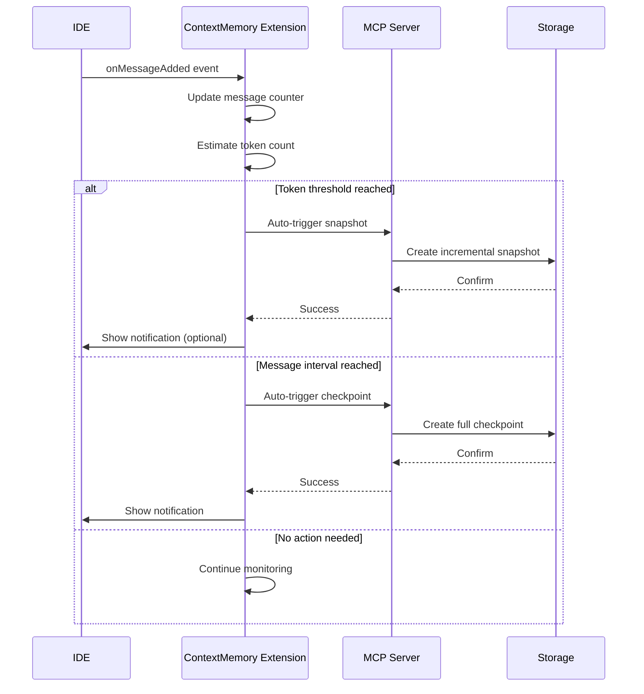
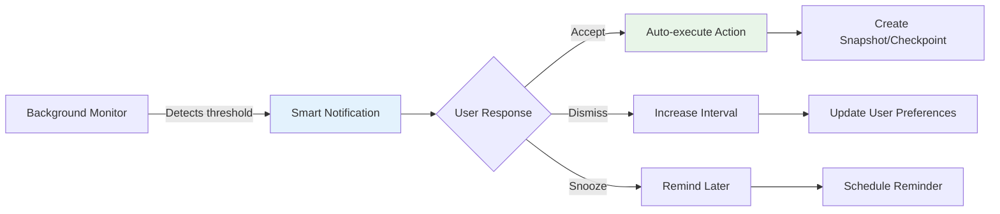
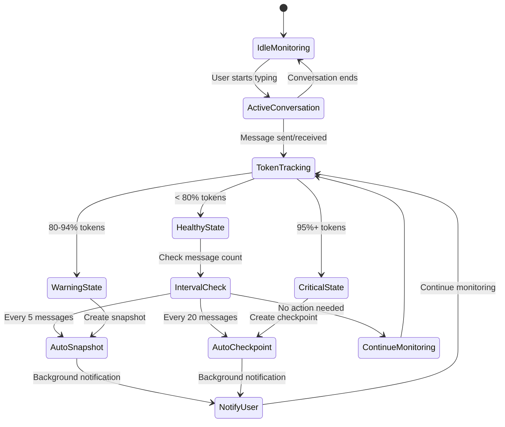

# Automation Trigger Mechanisms

## Overview

This document defines how the ContextMemory automation system can be triggered, covering manual commands, polling mechanisms, threshold-based triggers, and future automation approaches.

## Current Trigger System (Phase 2)

### Manual Trigger Architecture



### Current Limitations

```ascii
Current Manual Trigger Flow:

┌─────────────────────────────────────────────────────────────┐
│                   Manual Process                            │
├─────────────────────────────────────────────────────────────┤
│                                                             │
│  Step 1: User types @contextmemory monitor                  │
│    ├── User must remember to check                          │
│    ├── No automatic reminders                               │
│    └── Reactive rather than proactive                       │
│                                                             │
│  Step 2: System provides recommendation                     │
│    ├── "Create snapshot - message interval reached"         │
│    ├── "Create checkpoint - approaching limit"              │
│    └── User must act on recommendation                      │
│                                                             │
│  Step 3: User follows recommendation                        │
│    ├── Types @contextmemory snapshot                        │
│    ├── Types @contextmemory checkpoint                      │
│    └── Manual execution required                            │
│                                                             │
│  Problems:                                                  │
│    × User forgets to monitor                                │
│    × Context loss before manual check                       │
│    × Interrupts conversation flow                           │
│    × Requires domain knowledge                              │
└─────────────────────────────────────────────────────────────┘
```

## Enhanced Trigger Options

### Option 1: Polling-Based Automation



**Implementation:**

```go
// Background polling service
type ConversationPoller struct {
    client      MCPClient
    interval    time.Duration
    active      bool
    
    // Configuration
    maxTokens          int
    warningThreshold   float64
    criticalThreshold  float64
    snapshotInterval   int
    checkpointInterval int
}

func (p *ConversationPoller) Start() {
    ticker := time.NewTicker(p.interval)
    defer ticker.Stop()
    
    for {
        select {
        case <-ticker.C:
            if p.active {
                p.checkAllActiveConversations()
            }
        case <-p.stopChan:
            return
        }
    }
}

func (p *ConversationPoller) checkAllActiveConversations() {
    conversations := p.getActiveConversations()
    
    for _, conv := range conversations {
        health := p.analyzeHealth(conv)
        
        switch health.Status {
        case "warning":
            if p.shouldAutoSnapshot(conv) {
                p.createAutoSnapshot(conv, "polling-threshold-warning")
            }
        case "critical":
            if p.shouldAutoCheckpoint(conv) {
                p.createAutoCheckpoint(conv, "polling-threshold-critical")
            }
        }
    }
}
```

**Pros:**
- **Automatic operation**: No user intervention required
- **Proactive preservation**: Prevents context loss
- **Configurable intervals**: Adjustable polling frequency
- **Background operation**: Doesn't interrupt workflow

**Cons:**
- **Resource usage**: Continuous polling consumes CPU/memory
- **Permission issues**: Requires background process management
- **IDE integration**: Needs deep IDE integration for conversation access
- **Complexity**: Additional service to manage

### Option 2: Event-Driven Triggers (IDE Integration)



**Implementation:**

```typescript
// VS Code/Cursor extension integration
class ContextMemoryExtension {
    private messageCount = 0;
    private tokenCount = 0;
    private lastCheckpoint: Date | null = null;
    private lastSnapshot: Date | null = null;
    
    // IDE event listeners
    onDidReceiveMessage(message: Message) {
        this.messageCount++;
        this.tokenCount += this.estimateTokens(message.content);
        
        this.checkAutomationTriggers();
    }
    
    onDidSendMessage(message: Message) {
        this.messageCount++;
        this.tokenCount += this.estimateTokens(message.content);
        
        this.checkAutomationTriggers();
    }
    
    private checkAutomationTriggers() {
        const utilization = this.tokenCount / this.maxTokens;
        const messagesSinceSnapshot = this.getMessagesSince(this.lastSnapshot);
        const messagesSinceCheckpoint = this.getMessagesSince(this.lastCheckpoint);
        
        // Threshold-based triggers
        if (utilization >= 0.95) {
            this.autoCreateCheckpoint("critical-threshold");
        } else if (utilization >= 0.8) {
            this.autoCreateSnapshot("warning-threshold");
        }
        
        // Interval-based triggers
        else if (messagesSinceCheckpoint >= 20) {
            this.autoCreateCheckpoint("message-interval");
        } else if (messagesSinceSnapshot >= 5) {
            this.autoCreateSnapshot("message-interval");
        }
    }
    
    private async autoCreateSnapshot(reason: string) {
        try {
            const result = await this.mcpClient.call('contextmemory_snapshot', {
                conversationId: this.currentConversationId,
                recentContent: this.getRecentContent(),
                tokenCount: this.tokenCount,
                messagesSince: this.getMessagesSince(this.lastSnapshot),
                autoGenerated: true,
                triggerReason: reason
            });
            
            this.lastSnapshot = new Date();
            this.showNotification(`Snapshot created: ${result.name}`, 'info');
        } catch (error) {
            this.showNotification(`Failed to create snapshot: ${error.message}`, 'error');
        }
    }
}
```

**Pros:**
- **Real-time response**: Immediate trigger when thresholds reached
- **Accurate tracking**: Direct access to conversation state
- **Low overhead**: Event-driven, no polling required
- **IDE native**: Deep integration with development workflow

**Cons:**
- **Extension dependency**: Requires custom extension for each IDE
- **Development complexity**: Different API for each IDE
- **Installation barrier**: Users must install extension
- **Update coordination**: Extension and MCP server must stay in sync

### Option 3: Hybrid Trigger System (Recommended)

```ascii
Hybrid Trigger Architecture:

┌─────────────────────────────────────────────────────────────┐
│                   Trigger Sources                           │
├─────────────────────────────────────────────────────────────┤
│                                                             │
│  Manual Triggers (Always Available):                        │
│  ├── @contextmemory monitor                                 │
│  ├── @contextmemory snapshot                                │
│  ├── @contextmemory checkpoint                              │
│  └── User-initiated commands                                │
│                                                             │
│  Semi-Automatic (Optional):                                 │
│  ├── Periodic health checks (user configurable)             │
│  ├── Smart notifications (non-intrusive)                    │
│  ├── Threshold warnings (with auto-actions)                 │
│  └── Schedule-based operations                              │
│                                                             │
│  Future Automatic (Roadmap):                                │
│  ├── Real-time IDE integration                              │
│  ├── Machine learning triggers                              │
│  ├── Context-aware automation                               │
│  └── Seamless background operation                          │
└─────────────────────────────────────────────────────────────┘
```

## Implementation Roadmap

### Phase 2.1: Enhanced Manual Triggers (Current)

**Features:**
- Manual health monitoring via `@contextmemory monitor`
- Manual snapshot/checkpoint creation
- Smart recommendations based on analysis
- Threshold detection and guidance

**Example Usage:**
```bash
# User checks conversation health
@contextmemory monitor --conversation-id "current"

# System responds with:
# Status: warning (85% token utilization)  
# Recommendation: Create incremental snapshot - approaching warning threshold
# Action: @contextmemory snapshot --conversation-id "current"

# User follows recommendation
@contextmemory snapshot --conversation-id "current" --auto-content
```

### Phase 2.2: Smart Notifications



**Implementation:**
```typescript
interface SmartNotification {
    type: 'threshold-warning' | 'interval-reminder' | 'context-risk';
    severity: 'info' | 'warning' | 'critical';
    message: string;
    suggestedAction: string;
    autoExecute: boolean;
    dismissible: boolean;
    
    // User response options
    actions: {
        accept: () => Promise<void>;
        dismiss: () => void;
        snooze: (duration: number) => void;
        configure: () => void;
    };
}

// Example notification
const thresholdWarning: SmartNotification = {
    type: 'threshold-warning',
    severity: 'warning',
    message: 'Conversation approaching token limit (85% of 100k)',
    suggestedAction: 'Create incremental snapshot to preserve recent context',
    autoExecute: false,
    dismissible: true,
    
    actions: {
        accept: async () => {
            await mcpClient.call('contextmemory_snapshot', {
                conversationId: getCurrentConversationId(),
                autoGenerated: true,
                triggerReason: 'user-accepted-notification'
            });
        },
        dismiss: () => {
            updateUserPreference('notification_threshold', 0.9); // Increase threshold
        },
        snooze: (minutes) => {
            scheduleReminder(minutes, this);
        }
    }
};
```

### Phase 2.3: Background Monitoring

```go
// Background service configuration
type BackgroundConfig struct {
    Enabled            bool          `json:"enabled"`
    CheckInterval      time.Duration `json:"check_interval"`
    NotificationLevel  string        `json:"notification_level"` // none, minimal, normal, verbose
    AutoActions        bool          `json:"auto_actions"`
    
    // Trigger thresholds
    WarningThreshold   float64       `json:"warning_threshold"`
    CriticalThreshold  float64       `json:"critical_threshold"`
    SnapshotInterval   int           `json:"snapshot_interval"`
    CheckpointInterval int           `json:"checkpoint_interval"`
    
    // Privacy settings
    MonitorWorkHours   bool          `json:"monitor_work_hours_only"`
    WorkHoursStart     string        `json:"work_hours_start"`
    WorkHoursEnd       string        `json:"work_hours_end"`
}

// Default configuration
var DefaultBackgroundConfig = BackgroundConfig{
    Enabled:            false, // Opt-in by default
    CheckInterval:      30 * time.Second,
    NotificationLevel:  "normal",
    AutoActions:        false, // Manual approval required
    WarningThreshold:   0.8,
    CriticalThreshold:  0.95,
    SnapshotInterval:   5,
    CheckpointInterval: 20,
    MonitorWorkHours:   true,
    WorkHoursStart:     "09:00",
    WorkHoursEnd:       "17:00",
}
```

### Phase 3: Full Automation



## Configuration Examples

### User Preference Profiles

```yaml
# Conservative User (Manual Control)
profile: manual
automation:
  enabled: false
  notifications: minimal
  auto_actions: false
triggers:
  manual_only: true
  reminder_frequency: never

# Balanced User (Smart Assistance)  
profile: assisted
automation:
  enabled: true
  notifications: normal
  auto_actions: false
triggers:
  smart_notifications: true
  threshold_warnings: true
  interval_reminders: true
  
# Power User (Full Automation)
profile: automated
automation:
  enabled: true
  notifications: verbose
  auto_actions: true
triggers:
  background_monitoring: true
  automatic_snapshots: true
  automatic_checkpoints: true
  ml_optimization: true
```

### Workspace-Specific Configuration

```json
{
  "contextmemory": {
    "project": "high-frequency-development",
    "automation": {
      "snapshot_interval": 3,
      "checkpoint_interval": 10,
      "warning_threshold": 0.7,
      "critical_threshold": 0.85,
      "background_monitoring": true,
      "auto_actions": true
    },
    "notifications": {
      "level": "minimal",
      "delivery": "in-editor-only",
      "sound": false
    }
  }
}
```

## Recommended Approach: Progressive Automation

### Phase 2.1: Manual Triggers
- Current manual triggers with recommendations
- Improved user experience with better guidance and shortcuts
- Configuration options for user preferences

### Phase 2.2: Assisted Automation
- Notifications when thresholds approached
- One-click actions to execute recommendations
- Usage analytics to optimize triggers

### Phase 2.3: Background Intelligence
- Background monitoring with user approval
- Pattern-based triggers based on conversation patterns
- Auto-configuration based on usage patterns

### Phase 3: Automated System
- Adaptive triggers based on user behavior
- Real-time IDE integration with event-driven triggers
- Context-aware automation understanding conversation types

This progressive approach ensures users maintain control while progressively introducing automation to facilitate the workflow.
